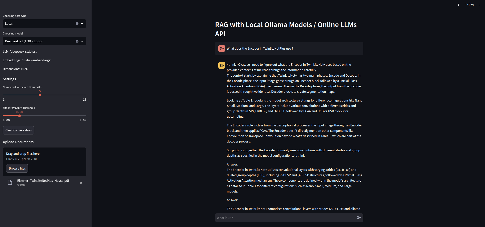

# Local ChatPDF with Local Ollama Models / Online LLM APIs

**ChatPDF** is a Retrieval-Augmented Generation (RAG) application that allows users to upload PDF documents and interact with them through a chatbot interface. The system uses advanced embedding models and a local vector store for efficient and accurate question-answering.

This project is inspired by [chatpdf-rag-deepseek-r1](https://github.com/paquino11/chatpdf-rag-deepseek-r1).

## Features

- **PDF Upload**: Upload one or multiple PDF documents to enable question-answering across their combined content.
- **RAG Workflow**: Combines retrieval and generation for high-quality responses.
- **Customizable Retrieval**: Adjust the number of retrieved results (`k`) and similarity threshold to fine-tune performance.
- **Memory Management**: Easily clear vector store and retrievers to reset the system.
- **Streamlit Interface**: A user-friendly web application for seamless interaction.

## User Interface


---

## Installation

Follow the steps below to set up and run the application:

### 1. Clone the Repository

```bash
git clone https://github.com/DucTriCE/ChatPDF-LocalLLMs-OnlineAPIs.git
cd ChatPDF-LocalLLMs-OnlineAPIs
```

### 2. Install Docker

Make sure Docker and Docker Compose is installed on your system. You can follow the instructions [here](https://www.digitalocean.com/community/tutorials/how-to-install-and-use-docker-compose-on-ubuntu-20-04) (This tutorial is for Ubuntu 20.04, you can find different tutorial based on your system).

### 3. Build and Run the Docker Container

Build the Docker image and run the container using Docker Compose:

```bash
docker-compose up --build
```
If already built, just run the application using the following command:

```bash
docker-compose up
```

## Usage

### 1. Start the Application

The application will be available at `http://localhost:8501`.

### 2. Choosing Models
#### Local Ollama Models

Ollama provides a variety of models, with additional options available at [Ollama](https://ollama.com/search). You can add more models by adjusting config.py as you wish. The Deepseek R1 model is included by default when building the project, while other models may require additional time for downloading.

| Model Name | Parameters | Size | Identifier | Embedding Model | Dimensions |
|------------|------------|------|------------|----------------|------------|
| Deepseek R1 (*available) | 1.3B | 1.3GB | `deepseek-r1:latest` | `mxbai-embed-large` | 1024 |
| Llama 3.2 | 3B | 2.0GB | `llama3.2` | `all-minilm` | 1024 |
| Llama 3.2 | 1B | 1.3GB | `llama3.2:1b` | `all-minilm` | 1024 |
| Llama 3.1 | 8B | 4.7GB | `llama3.1` | `all-minilm` | 1024 |
| Llama 3.1 | 70B | 40GB | `llama3.1:70b` | `all-minilm` | 1024 |
| Llama 3.1 | 405B | 231GB | `llama3.1:405b` | `all-minilm` | 1024 |
| Phi 3 Mini | 3.8B | 2.3GB | `phi3` | `all-minilm` | 1024 |
| Phi 3 Medium | 14B | 7.9GB | `phi3:medium` | `all-minilm` | 1024 |
| Gemma 2 | 2B | 1.6GB | `gemma2:2b` | `all-minilm` | 1024 |
| Gemma 2 | 9B | 5.5GB | `gemma2` | `all-minilm` | 1024 |
| Gemma 2 | 27B | 16GB | `gemma2:27b` | `all-minilm` | 1024 |
| Mistral | 7B | 4.1GB | `mistral` | `all-minilm` | 1024 |
| Moondream 2 | 1.4B | 829MB | `moondream` | `all-minilm` | 1024 |
| Neural Chat | 7B | 4.1GB | `neural-chat` | `all-minilm` | 1024 |
| Starling | 7B | 4.1GB | `starling-lm` | `all-minilm` | 1024 |
| Code Llama | 7B | 3.8GB | `codellama` | `all-minilm` | 1024 |
| Llama 2 Uncensored | 7B | 3.8GB | `llama2-uncensored` | `all-minilm` | 1024 |
| LLaVA | 7B | 4.5GB | `llava` | `all-minilm` | 1024 |
| Solar | 10.7B | 6.1GB | `solar` | `all-minilm` | 1024 |

#### Online Model APIs

For GPT or Gemini models, you must specify their API key in the provided input field.

| Model Name | Identifier | Embedding Model | Dimensions |
|------------|------------|----------------|------------|
| GPT-4o Mini | `gpt-4o-mini` | `text-embedding-3-large` | 3072 |
| Gemini 2.0 Flash | `gemini-2.0-flash-exp` | `text-embedding-004` | 768 |
| Gemini 1.5 Pro | `gemini-1.5-pro` | `text-embedding-004` | 768 |
| Gemini 1.5 Flash | `gemini-1.5-flash` | `text-embedding-004` | 768 |

### 3. Upload Documents

- Navigate to the **Upload a Document** section in the web interface.
- Upload one or multiple PDF files to process their content.
- Each file will be ingested automatically and confirmation messages will show processing time.

### 4. Ask Questions

- Type your question in the chat input box and press Enter.
- Adjust retrieval settings (`k` and `similarity threshold`) in the **Settings** section for better responses.


## Project Structure

```
├── image                   # Directory containing images used in the project
├── app.py                  # Streamlit app for the user interface
├── rag.py                  # Core RAG logic for LLMs/Embeddings loading, PDF ingestion and question-answering
├── utils.py                # Utility functions for the application
├── config.py               # Configuration file for model settings
├── requirements.txt        # List of required Python dependencies
├── chroma_db_*/            # Local persistent vector store (auto-generated)
├── Dockerfile              # Dockerfile for building the image
├── docker-compose.yml      # Docker Compose configuration
└── README.md               # Project documentation
```


## Configuration

You can modify the following parameters in `config.py` to suit your needs:


## Requirements

- **Docker**: For containerization and running the application.
- **Streamlit**: Web framework for the user interface.
- **Ollama**: For embedding and LLM models.
- **LangChain**: Core framework for RAG.
- **PyPDF**: For PDF document processing.
- **ChromaDB**: Vector store for document embeddings.


## Acknowledgments

- [LangChain](https://github.com/hwchase17/langchain)
- [Streamlit](https://github.com/streamlit/streamlit)
- [Ollama](https://ollama.ai/)

